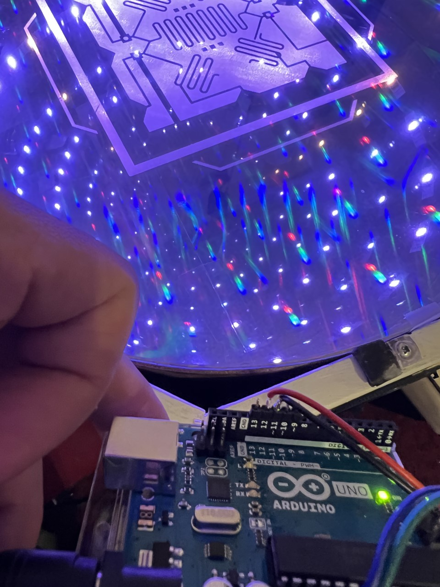
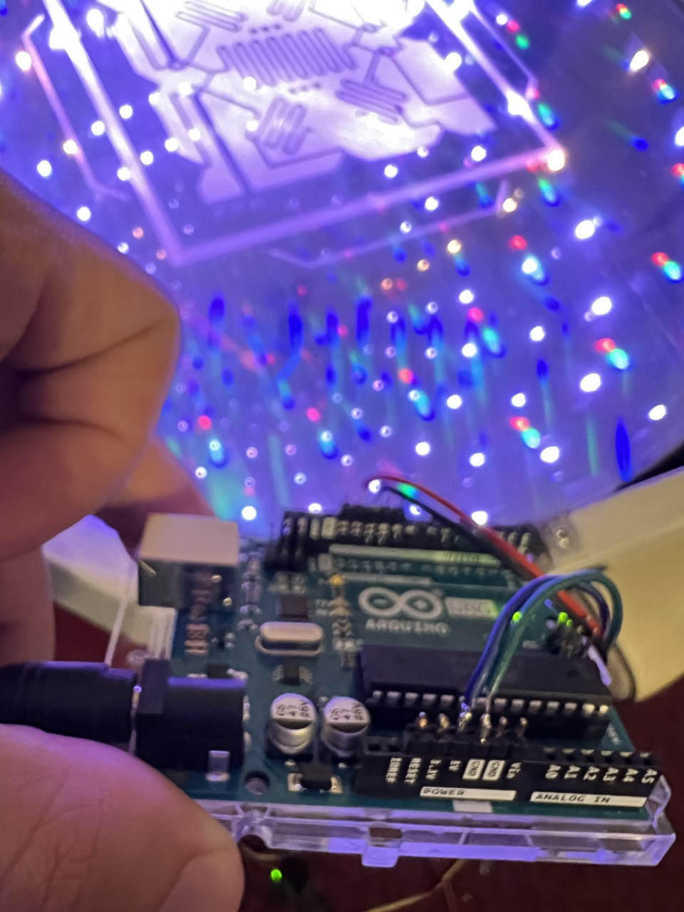
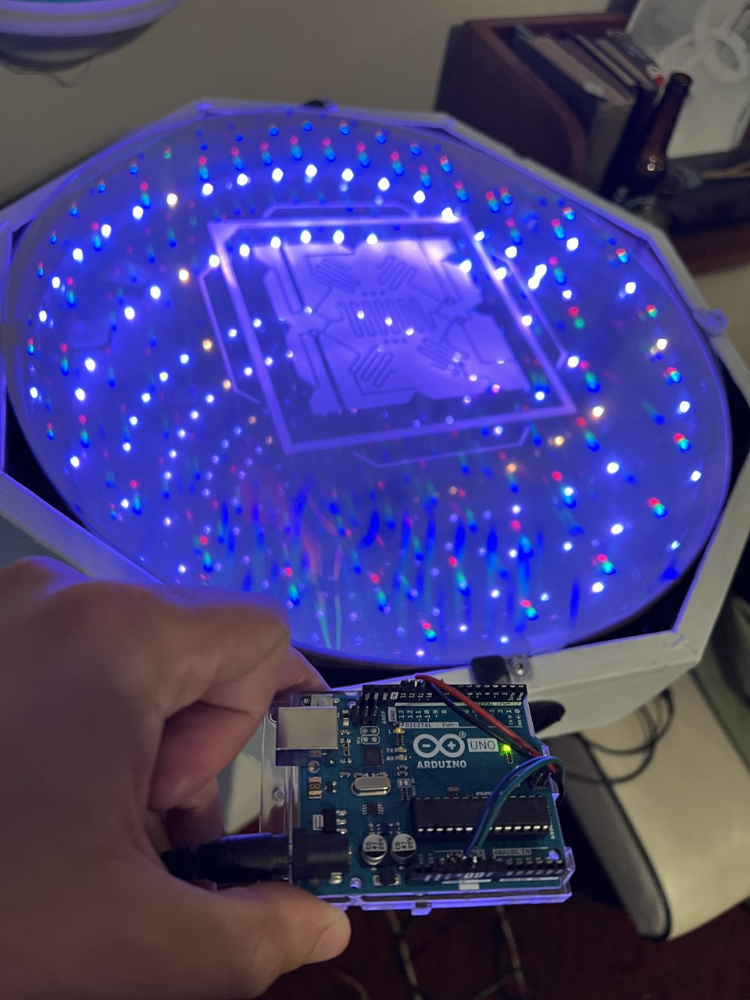
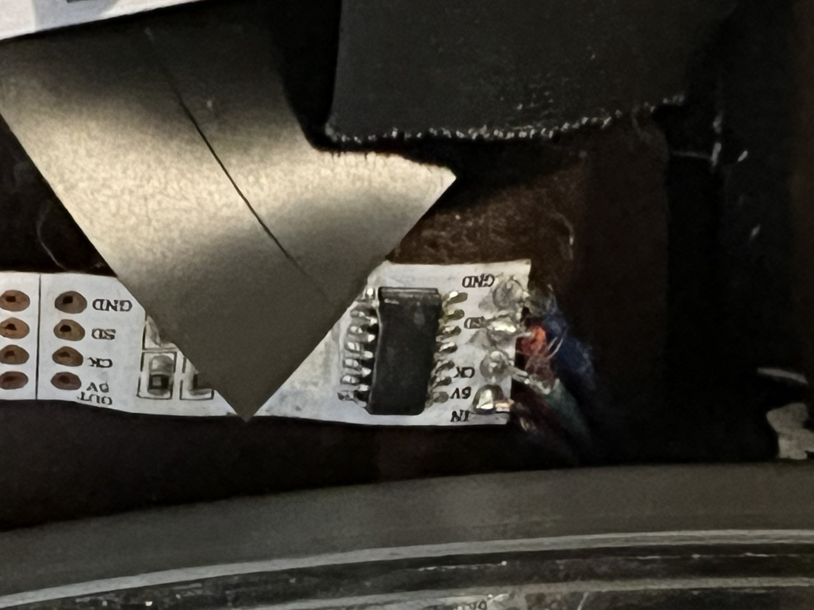

# xchurch LED Decoration 2k23
Repairs and shit.
LED strip Type: WS2801SO

5v CK SD GND\
Blk Grn Red Blu\
Blu Red Yel Grn\
Blu Red Blk Grn\
5V 12 11 11 GND\
Arduino Uno\
Powered via 9v 1A

Num LEDs\
Wheel 1 :47\
Wheel 2 :?47

The second wheel does not light up at all. One the first wheel I switched out the first 5 pixels thing they were fried. But it was actually my code not having the right clock pin. shoot. Now the First object has a few leds with blue not working. Will repair next time.

